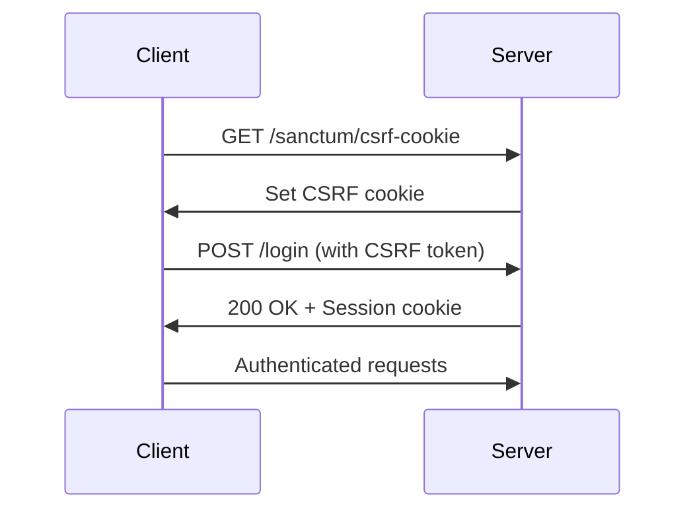
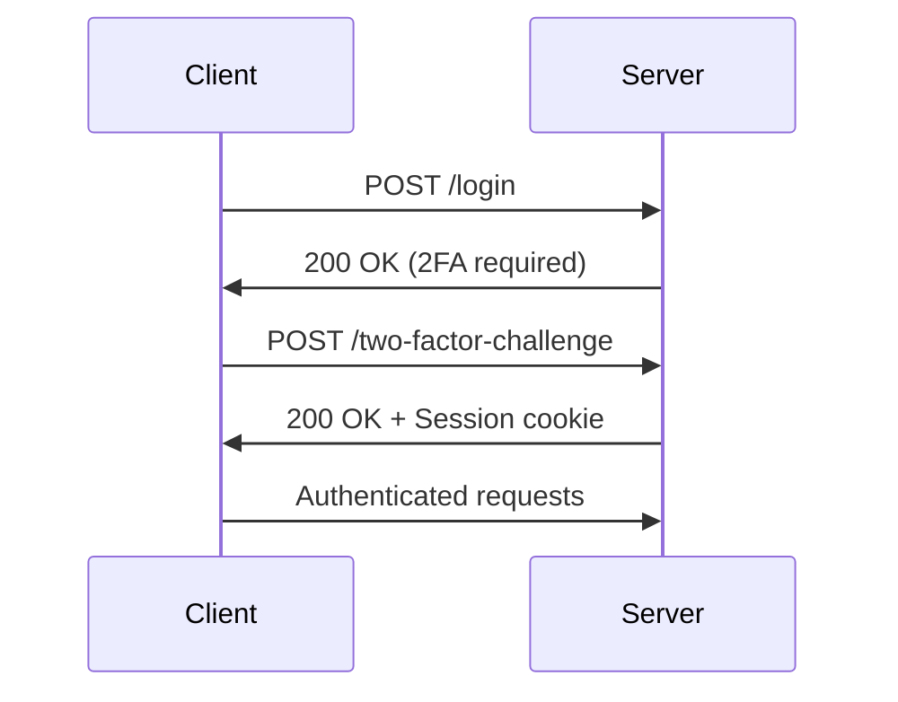

## Overview

MediaStream uses **Laravel Fortify** to provide a robust, secure authentication system with support for standard login, user registration, and two-factor authentication (2FA).

All authentication endpoints use **session-based authentication** with CSRF protection. API clients must include a valid CSRF token with requests that modify data.

## Authentication Features

<CardGroup cols={2}>
  <Card title="User Registration" icon="user-plus" href="/api/authentication/register">
    Create new user accounts with email and password
  </Card>
  <Card title="Login" icon="right-to-bracket" href="/api/authentication/login">
    Authenticate users with email and password
  </Card>
  <Card title="Two-Factor Authentication" icon="shield-halved" href="/api/authentication/two-factor">
    Enhanced security with TOTP-based 2FA
  </Card>
  <Card title="Session Management" icon="clock">
    Automatic session handling and token rotation
  </Card>
</CardGroup>

## Security Features

### Rate Limiting

Authentication endpoints are protected by rate limiting to prevent brute-force attacks:

- **Login**: 5 attempts per minute per email and IP address combination
- **Two-Factor Challenge**: 5 attempts per minute per session

<Warning>
  After exceeding the rate limit, clients will receive a `429 Too Many Requests` response and must wait before retrying.
</Warning>

### CSRF Protection

All authentication endpoints require CSRF token validation. The token must be:

1. Retrieved from the `/sanctum/csrf-cookie` endpoint
2. Included in the `X-XSRF-TOKEN` header for all subsequent requests

### Password Requirements

Passwords must meet Laravel's default password validation rules:

- Minimum 8 characters
- Must be confirmed (matching `password_confirmation` field)
- Cannot be commonly used passwords

## Base URL

All authentication endpoints are relative to your application's base URL:

```
https://your-domain.com
```

Fortify routes are registered with no prefix by default.

## Authentication Flow

### Standard Login Flow



### Two-Factor Authentication Flow



## Common Response Codes

<ResponseField name="200" type="OK">
  Authentication successful
</ResponseField>

<ResponseField name="401" type="Unauthorized">
  Invalid credentials or authentication required
</ResponseField>

<ResponseField name="422" type="Unprocessable Entity">
  Validation errors in request data
</ResponseField>

<ResponseField name="429" type="Too Many Requests">
  Rate limit exceeded
</ResponseField>

## Error Response Format

Validation errors follow Laravel's standard format:

```json
{
  "message": "The given data was invalid.",
  "errors": {
    "email": [
      "The email field is required."
    ],
    "password": [
      "The password field is required."
    ]
  }
}
```

## Next Steps

<CardGroup cols={3}>
  <Card title="Register Users" icon="user-plus" href="/api/authentication/register">
    Create new accounts
  </Card>
  <Card title="Login" icon="right-to-bracket" href="/api/authentication/login">
    Authenticate users
  </Card>
  <Card title="Enable 2FA" icon="shield-halved" href="/api/authentication/two-factor">
    Setup two-factor auth
  </Card>
</CardGroup>
