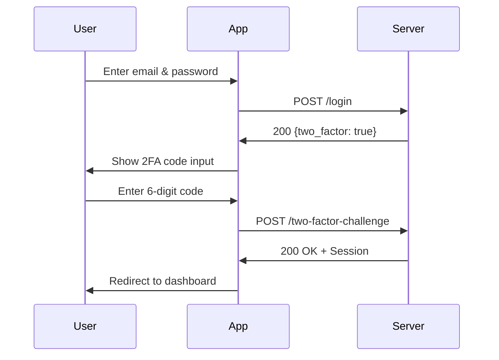

## Overview

MediaStream supports **Time-based One-Time Password (TOTP)** two-factor authentication using authenticator apps like Google Authenticator, Authy, or 1Password.

When enabled, users must provide both their password and a 6-digit code from their authenticator app to login.

<Info>
  Two-factor authentication is configured per user and is completely optional.
</Info>

## 2FA Endpoints

<CardGroup cols={2}>
  <Card title="Enable 2FA" icon="shield-halved">
    `POST /user/two-factor-authentication`
  </Card>
  <Card title="Disable 2FA" icon="shield-xmark">
    `DELETE /user/two-factor-authentication`
  </Card>
  <Card title="Get QR Code" icon="qrcode">
    `GET /user/two-factor-qr-code`
  </Card>
  <Card title="Get Secret Key" icon="key">
    `GET /user/two-factor-secret-key`
  </Card>
  <Card title="Get Recovery Codes" icon="list-ol">
    `GET /user/two-factor-recovery-codes`
  </Card>
  <Card title="Regenerate Codes" icon="arrows-rotate">
    `POST /user/two-factor-recovery-codes`
  </Card>
  <Card title="Confirm 2FA" icon="check-circle">
    `POST /user/confirmed-two-factor-authentication`
  </Card>
  <Card title="2FA Challenge" icon="lock">
    `POST /two-factor-challenge`
  </Card>
</CardGroup>

---

## Enable Two-Factor Authentication

<Note>
  User must be authenticated to enable 2FA. Password confirmation may be required based on Fortify configuration.
</Note>

### Endpoint

```http
POST /user/two-factor-authentication
```

### Request Headers

<ParamField header="X-XSRF-TOKEN" type="string" required>
  CSRF token
</ParamField>

<ParamField header="Accept" type="string" required>
  Must be `application/json`
</ParamField>

### Response

<Tabs>
  <Tab title="200 - Success">
    Two-factor authentication enabled. Secret and recovery codes generated.

    ```json
    {
      "success": true
    }
    ```

    <Info>
      After enabling, retrieve the QR code and recovery codes for the user.
    </Info>
  </Tab>

  <Tab title="423 - Password Confirmation Required">
    User must confirm their password before enabling 2FA.

    ```json
    {
      "message": "Password confirmation required."
    }
    ```

    Redirect user to `/user/confirm-password` endpoint.
  </Tab>
</Tabs>

### Example

```javascript
await fetch('https://your-domain.com/user/two-factor-authentication', {
  method: 'POST',
  headers: {
    'Accept': 'application/json',
    'X-XSRF-TOKEN': csrfToken
  },
  credentials: 'include'
});
```

---

## Get QR Code

Retrieve a QR code for scanning with an authenticator app.

### Endpoint

```http
GET /user/two-factor-qr-code
```

### Response

<Tabs>
  <Tab title="200 - Success">
    Returns an SVG QR code that users can scan with their authenticator app.

    ```json
    {
      "svg": "<svg xmlns='http://www.w3.org/2000/svg' viewBox='0 0 100 100'>...</svg>"
    }
    ```

    <ResponseField name="svg" type="string">
      SVG markup for the QR code
    </ResponseField>
  </Tab>

  <Tab title="404 - Not Found">
    Two-factor authentication is not enabled for this user.

    ```json
    {
      "message": "Two factor authentication has not been enabled."
    }
    ```
  </Tab>
</Tabs>

### Example

```javascript
const response = await fetch('https://your-domain.com/user/two-factor-qr-code', {
  headers: {
    'Accept': 'application/json',
    'X-XSRF-TOKEN': csrfToken
  },
  credentials: 'include'
});

const data = await response.json();
// Display the SVG QR code
document.getElementById('qr-code').innerHTML = data.svg;
```

---

## Get Secret Key

Retrieve the plain text secret key for manual entry into authenticator apps.

### Endpoint

```http
GET /user/two-factor-secret-key
```

### Response

```json
{
  "secretKey": "JBSWY3DPEHPK3PXP"
}
```

<ResponseField name="secretKey" type="string">
  Base32-encoded secret key for manual entry
</ResponseField>

### Example

```javascript
const response = await fetch('https://your-domain.com/user/two-factor-secret-key', {
  headers: {
    'Accept': 'application/json',
    'X-XSRF-TOKEN': csrfToken
  },
  credentials: 'include'
});

const data = await response.json();
console.log('Secret Key:', data.secretKey);
```

---

## Get Recovery Codes

Retrieve recovery codes that can be used if the user loses access to their authenticator device.

<Warning>
  Recovery codes should be stored securely. Each code can only be used once.
</Warning>

### Endpoint

```http
GET /user/two-factor-recovery-codes
```

### Response

```json
[
  "a1b2c3d4e5f6g7h8",
  "i9j0k1l2m3n4o5p6",
  "q7r8s9t0u1v2w3x4",
  "y5z6a7b8c9d0e1f2",
  "g3h4i5j6k7l8m9n0",
  "o1p2q3r4s5t6u7v8",
  "w9x0y1z2a3b4c5d6",
  "e7f8g9h0i1j2k3l4"
]
```

Returns an array of 8 single-use recovery codes.

### Example

```javascript
const response = await fetch('https://your-domain.com/user/two-factor-recovery-codes', {
  headers: {
    'Accept': 'application/json',
    'X-XSRF-TOKEN': csrfToken
  },
  credentials: 'include'
});

const codes = await response.json();
codes.forEach((code, index) => {
  console.log(`Recovery Code ${index + 1}: ${code}`);
});
```

---

## Regenerate Recovery Codes

Generate a new set of recovery codes. This invalidates all previous codes.

### Endpoint

```http
POST /user/two-factor-recovery-codes
```

### Response

```json
{
  "success": true
}
```

<Info>
  After regenerating, immediately fetch the new codes with `GET /user/two-factor-recovery-codes`.
</Info>

### Example

```javascript
// Regenerate codes
await fetch('https://your-domain.com/user/two-factor-recovery-codes', {
  method: 'POST',
  headers: {
    'Accept': 'application/json',
    'X-XSRF-TOKEN': csrfToken
  },
  credentials: 'include'
});

// Fetch new codes
const response = await fetch('https://your-domain.com/user/two-factor-recovery-codes', {
  headers: {
    'Accept': 'application/json',
    'X-XSRF-TOKEN': csrfToken
  },
  credentials: 'include'
});

const newCodes = await response.json();
```

---

## Confirm Two-Factor Authentication

Confirm that 2FA is working correctly by verifying a code from the authenticator app.

<Note>
  This step is required when `'confirm' => true` is set in the Fortify configuration.
</Note>

### Endpoint

```http
POST /user/confirmed-two-factor-authentication
```

### Request Body

<ParamField body="code" type="string" required>
  6-digit code from authenticator app
</ParamField>

### Response

<Tabs>
  <Tab title="200 - Success">
    Two-factor authentication confirmed and fully enabled.

    ```json
    {
      "success": true
    }
    ```
  </Tab>

  <Tab title="422 - Invalid Code">
    The provided code is invalid or expired.

    ```json
    {
      "message": "The provided two factor authentication code was invalid.",
      "errors": {
        "code": [
          "The provided two factor authentication code was invalid."
        ]
      }
    }
    ```
  </Tab>
</Tabs>

### Example

```javascript
const response = await fetch('https://your-domain.com/user/confirmed-two-factor-authentication', {
  method: 'POST',
  headers: {
    'Content-Type': 'application/json',
    'Accept': 'application/json',
    'X-XSRF-TOKEN': csrfToken
  },
  credentials: 'include',
  body: JSON.stringify({
    code: '123456'
  })
});
```

---

## Two-Factor Challenge

Complete the two-factor authentication challenge during login.

### Endpoint

```http
POST /two-factor-challenge
```

### Request Body

Provide **either** a code from the authenticator app **or** a recovery code:

<ParamField body="code" type="string">
  6-digit code from authenticator app
</ParamField>

<ParamField body="recovery_code" type="string">
  Single-use recovery code (alternative to `code`)
</ParamField>

<Warning>
  Only send one field: either `code` OR `recovery_code`, not both.
</Warning>

### Response

<Tabs>
  <Tab title="200 - Success">
    Authentication successful. User is now logged in.

    ```json
    {
      "two_factor": false
    }
    ```

    Session cookie is set and user can access protected routes.
  </Tab>

  <Tab title="422 - Invalid Code">
    The provided code or recovery code is invalid.

    ```json
    {
      "message": "The provided two factor authentication code was invalid.",
      "errors": {
        "code": [
          "The provided two factor authentication code was invalid."
        ]
      }
    }
    ```
  </Tab>

  <Tab title="429 - Rate Limited">
    Too many failed attempts. Rate limit: **5 attempts per minute** per session.

    ```json
    {
      "message": "Too many requests."
    }
    ```
  </Tab>
</Tabs>

### Examples

<CodeGroup>

```javascript Authenticator Code
await fetch('https://your-domain.com/two-factor-challenge', {
  method: 'POST',
  headers: {
    'Content-Type': 'application/json',
    'Accept': 'application/json',
    'X-XSRF-TOKEN': csrfToken
  },
  credentials: 'include',
  body: JSON.stringify({
    code: '123456'
  })
});
```

```javascript Recovery Code
await fetch('https://your-domain.com/two-factor-challenge', {
  method: 'POST',
  headers: {
    'Content-Type': 'application/json',
    'Accept': 'application/json',
    'X-XSRF-TOKEN': csrfToken
  },
  credentials: 'include',
  body: JSON.stringify({
    recovery_code: 'a1b2c3d4e5f6g7h8'
  })
});
```

</CodeGroup>

---

## Disable Two-Factor Authentication

Disable two-factor authentication for the authenticated user.

### Endpoint

```http
DELETE /user/two-factor-authentication
```

### Request Headers

<ParamField header="X-XSRF-TOKEN" type="string" required>
  CSRF token
</ParamField>

### Response

```json
{
  "success": true
}
```

Two-factor authentication is disabled and all recovery codes are invalidated.

### Example

```javascript
await fetch('https://your-domain.com/user/two-factor-authentication', {
  method: 'DELETE',
  headers: {
    'Accept': 'application/json',
    'X-XSRF-TOKEN': csrfToken
  },
  credentials: 'include'
});
```

---

## Complete 2FA Setup Flow

<Steps>
  <Step title="Enable 2FA">
    ```javascript
    POST /user/two-factor-authentication
    ```
  </Step>
  
  <Step title="Get QR Code">
    ```javascript
    GET /user/two-factor-qr-code
    ```
    Display the QR code for the user to scan with their authenticator app.
  </Step>
  
  <Step title="Show Secret Key (Optional)">
    ```javascript
    GET /user/two-factor-secret-key
    ```
    Provide the secret key for manual entry.
  </Step>
  
  <Step title="Confirm Setup">
    ```javascript
    POST /user/confirmed-two-factor-authentication
    ```
    User enters a code from their app to confirm it's working.
  </Step>
  
  <Step title="Show Recovery Codes">
    ```javascript
    GET /user/two-factor-recovery-codes
    ```
    Display the 8 recovery codes for the user to save securely.
  </Step>
</Steps>

## Login Flow with 2FA



## Database Fields

Two-factor authentication data is stored in the `users` table:

```sql
two_factor_secret TEXT NULL,
two_factor_recovery_codes TEXT NULL,
two_factor_confirmed_at TIMESTAMP NULL
```

<Info>
  All 2FA fields are encrypted at rest and never exposed in API responses.
</Info>

## Security Best Practices

<AccordionGroup>
  <Accordion title="Recovery Codes">
    - Instruct users to save recovery codes in a secure location
    - Each recovery code can only be used once
    - Regenerate codes if user suspects they've been compromised
  </Accordion>

  <Accordion title="Rate Limiting">
    - 2FA challenge endpoint is rate-limited to 5 attempts per minute
    - This prevents brute-force attacks on 2FA codes
  </Accordion>

  <Accordion title="Time Synchronization">
    - TOTP codes are time-based (30-second window)
    - Ensure server time is synchronized with NTP
    - Codes have a small grace period for clock drift
  </Accordion>

  <Accordion title="Password Confirmation">
    - Require password confirmation before enabling/disabling 2FA
    - Set `'confirmPassword' => true` in Fortify configuration
  </Accordion>
</AccordionGroup>

## Common Issues

<AccordionGroup>
  <Accordion title="Invalid authentication code">
    - Ensure device time is synchronized correctly
    - Code may have expired (codes change every 30 seconds)
    - Verify the secret was scanned correctly
    - Try using a recovery code instead
  </Accordion>

  <Accordion title="QR code not displaying">
    - User must enable 2FA first (`POST /user/two-factor-authentication`)
    - Check that `Features::twoFactorAuthentication()` is enabled
    - Ensure user is authenticated
  </Accordion>

  <Accordion title="Lost access to authenticator">
    - User can login using a recovery code
    - After login, they can disable and re-enable 2FA
    - If recovery codes are also lost, admin intervention is required
  </Accordion>
</AccordionGroup>

## Related Endpoints

<CardGroup cols={2}>
  <Card title="Login" icon="right-to-bracket" href="/api/authentication/login">
    Initial authentication
  </Card>
  <Card title="Profile Settings" icon="user-gear">
    Manage user settings
  </Card>
</CardGroup>
