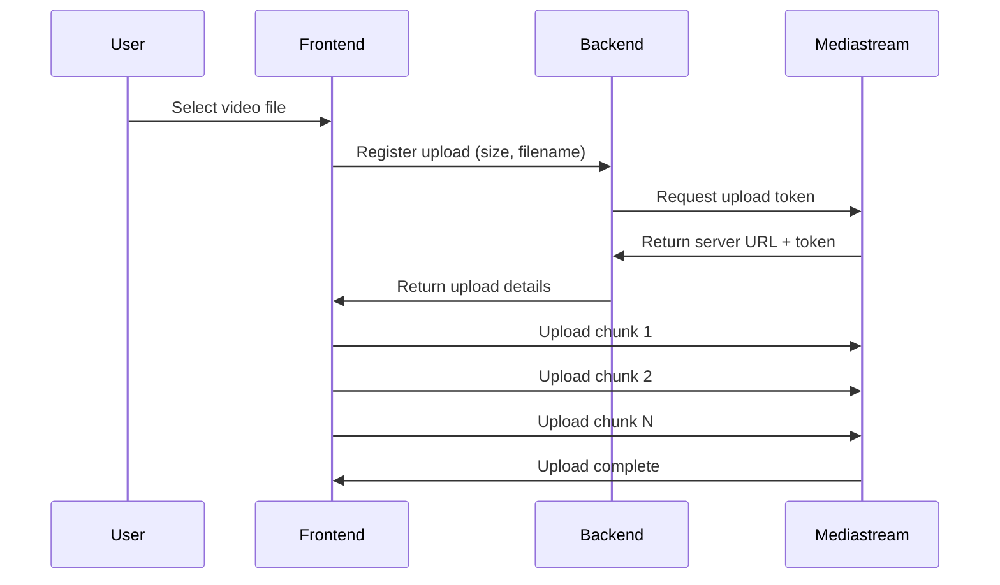

## Overview

MediaStream provides a robust video upload system that handles large video files by breaking them into chunks. This ensures reliable uploads even for multi-gigabyte video files, with real-time progress tracking.

<CardGroup cols={2}>
  <Card title="Chunked Upload" icon="boxes-stacked">
    Split large files into manageable 10MB chunks
  </Card>
  <Card title="Progress Tracking" icon="chart-line">
    Real-time upload progress with percentage display
  </Card>
  <Card title="Resume Support" icon="rotate-right">
    Continue uploads if connection is interrupted
  </Card>
  <Card title="Large Files" icon="file-video">
    Support for videos of any size
  </Card>
</CardGroup>

## How It Works

The upload process follows a two-step approach:

1. **Register the upload** with your backend (which contacts Mediastream)
2. **Upload chunks** directly to Mediastream's servers



## Upload Component

The upload functionality is implemented as a Vue component with progress tracking.

### Complete Upload Implementation

```vue
<script setup lang="ts">
import { Input } from '@/components/ui/input'
import axios from 'axios'
import { Progress } from 'reka-ui/namespaced'
import { ref } from 'vue'

const progress = ref(0)

const handleFile = async (e: Event) => {
  const target = e.target as HTMLInputElement
  const file = target.files?.[0]
  if (!file) return

  const chunkSize = 10 * 1024 * 1024 // 10MB chunks
  const totalChunks = Math.ceil(file.size / chunkSize)
  let uploaded = 0

  interface ResponseUploadMedia {
    status: string
    data: {
      server: string
      token?: string
    }
  }

  try {
    // Step 1: Register the file with your backend
    const response = await axios.get<ResponseUploadMedia>('/api/media/upload', {
      params: {
        size: file.size,
        file_name: file.name,
        type: 'remote',
      },
    })

    const { server, token } = response.data.data

    // Step 2: Upload the file in chunks
    for (let i = 1; i <= totalChunks; i++) {
      const start = (i - 1) * chunkSize
      const end = Math.min(file.size, start + chunkSize)
      const chunk = file.slice(start, end)

      const formData = new FormData()
      formData.append('file', chunk)
      formData.append('name', file.name)
      if (token) formData.append('token', token)

      const uploadUrl = `${server}/${i}`

      const uploadRes = await axios.post(uploadUrl, formData, {
        headers: {
          'Content-Type': 'application/x-www-form-urlencoded',
        },
        onUploadProgress: (event) => {
          if (event.total) {
            const chunkProgress = (event.loaded / event.total) * (1 / totalChunks) * 100
            progress.value = Math.min(100, (uploaded / totalChunks) * 100 + chunkProgress)
          }
        },
      })

      if (uploadRes.status === 201 || uploadRes.status === 200) {
        uploaded++
      }
    }

    progress.value = 100
    console.log('✅ Upload complete!')
  } catch (error) {
    console.error('❌ Upload error:', error)
  }
}
</script>

<template>
  <div class="p-4">
    <Input type="file" accept="video/mp4" @change="handleFile" />
    
    <div v-if="progress > 0" class="mt-4 flex flex-col items-start gap-2">
      <Progress :value="progress" max="100" class="w-full" />
      <span>{{ progress.toFixed(0) }}%</span>
    </div>
  </div>
</template>
```

## Upload Configuration

### Chunk Size

The default chunk size is **10MB**, which provides a good balance between:

- **Reliability**: Smaller chunks are less likely to fail
- **Efficiency**: Larger chunks mean fewer HTTP requests
- **Progress Granularity**: More frequent progress updates

```javascript
const chunkSize = 10 * 1024 * 1024 // 10MB in bytes
const totalChunks = Math.ceil(file.size / chunkSize)
```

### Supported File Types

Currently, the upload component accepts:

```html
<Input type="file" accept="video/mp4" @change="handleFile" />
```

<Note>
  While the UI currently restricts to MP4 files, Mediastream supports various video formats including MP4, MOV, AVI, and more.
</Note>

## Backend Integration

The upload process requires backend support to communicate with Mediastream.

### Upload Controller

```php
class UploadMediaController extends Controller
{
    public function upload(Request $request)
    {
        $size = $request->query('size');
        $fileName = $request->query('file_name');

        $response = MediastreamService::request(
            '/media/upload',
            'get',
            [
                'size' => $size,
                'file_name' => $fileName,
            ]
        );

        return $response->json();
    }
}
```

### Mediastream Service

The service handles API authentication automatically:

```php
class MediastreamService
{
    public static function request(string $endpoint, string $method = 'get', array $data = []): Response
    {
        $baseUrl = rtrim(env('MEDIASTREAM_API_URL'), '/');
        $url = $baseUrl . '/' . ltrim($endpoint, '/');

        $client = Http::withHeaders([
            'X-API-Token' => env('MEDIASTREAM_API_KEY'),
            'Accept' => 'application/json',
        ]);

        switch (strtolower($method)) {
            case 'post':
                return $client->post($url, $data);
            case 'put':
                return $client->put($url, $data);
            case 'delete':
                return $client->delete($url, $data);
            default:
                return $client->get($url, $data);
        }
    }
}
```

<Tip>
  Store your Mediastream API credentials in the `.env` file for security:
  ```env
  MEDIASTREAM_API_URL=https://api.mdstrm.com/v1
  MEDIASTREAM_API_KEY=your_api_key_here
  ```
</Tip>

## Progress Tracking

The upload component provides detailed progress feedback to users.

### Progress Calculation

```javascript
const onUploadProgress = (event) => {
  if (event.total) {
    // Calculate progress for current chunk
    const chunkProgress = (event.loaded / event.total) * (1 / totalChunks) * 100
    
    // Combine with already uploaded chunks
    progress.value = Math.min(100, (uploaded / totalChunks) * 100 + chunkProgress)
  }
}
```

### Progress Display

The progress is shown using a visual progress bar and percentage:

```vue
<div v-if="progress > 0" class="mt-4 flex flex-col items-start gap-2">
  <Progress :value="progress" max="100" class="w-full" />
  <span>{{ progress.toFixed(0) }}%</span>
</div>
```

<CardGroup cols={3}>
  <Card title="0-33%" icon="1">
    Initial chunks uploading
  </Card>
  <Card title="34-66%" icon="2">
    Middle chunks in progress
  </Card>
  <Card title="67-100%" icon="3">
    Final chunks completing
  </Card>
</CardGroup>

## Upload Flow

### Step-by-Step Process

<Steps>
  <Step title="File Selection">
    User selects a video file through the file input
  </Step>
  
  <Step title="Registration">
    Frontend sends file metadata (size, name) to your backend
  </Step>
  
  <Step title="Token Generation">
    Backend requests upload token from Mediastream API
  </Step>
  
  <Step title="Chunk Creation">
    File is split into 10MB chunks using `File.slice()`
  </Step>
  
  <Step title="Chunk Upload">
    Each chunk is uploaded sequentially to Mediastream
  </Step>
  
  <Step title="Progress Updates">
    Progress bar updates as each chunk completes
  </Step>
  
  <Step title="Completion">
    All chunks uploaded, video ready for processing
  </Step>
</Steps>

## Error Handling

The upload system includes error handling for common issues:

```javascript
try {
  // Upload logic
  const uploadRes = await axios.post(uploadUrl, formData, {...})
  
  if (uploadRes.status === 201 || uploadRes.status === 200) {
    uploaded++  // Mark chunk as successfully uploaded
  }
} catch (error) {
  console.error('❌ Upload error:', error)
  // Handle error (retry, show notification, etc.)
}
```

### Common Upload Errors

<AccordionGroup>
  <Accordion title="Network Timeout">
    If a chunk upload times out:
    - The error will be caught and logged
    - Consider implementing retry logic for failed chunks
    - Check your network connection stability
  </Accordion>

  <Accordion title="File Too Large">
    If Mediastream rejects the file:
    - Verify your account's upload limits
    - Check the file format is supported
    - Ensure the file isn't corrupted
  </Accordion>

  <Accordion title="Invalid Token">
    If the upload token is rejected:
    - Verify your API key is correct
    - Check the token hasn't expired
    - Ensure proper authentication headers
  </Accordion>

  <Accordion title="Chunk Order Issues">
    If chunks arrive out of order:
    - The current implementation uploads sequentially
    - Don't modify the chunk numbering system
    - Ensure chunks are uploaded in the correct order
  </Accordion>
</AccordionGroup>

## Best Practices

<AccordionGroup>
  <Accordion title="File Validation">
    Before uploading, validate:
    - File size (set reasonable limits for your use case)
    - File format (MP4, MOV, etc.)
    - Video resolution and bitrate
    - File name (avoid special characters)
  </Accordion>

  <Accordion title="User Feedback">
    Provide clear feedback during upload:
    - Show progress percentage
    - Display estimated time remaining
    - Show success/error messages
    - Prevent navigation during upload
  </Accordion>

  <Accordion title="Network Resilience">
    Handle network issues gracefully:
    - Implement retry logic for failed chunks
    - Save upload state for resume capability
    - Show appropriate error messages
    - Allow users to cancel uploads
  </Accordion>

  <Accordion title="Performance">
    Optimize upload performance:
    - Use appropriate chunk sizes (10MB is recommended)
    - Consider parallel chunk uploads for faster transfer
    - Compress videos before upload when possible
    - Monitor bandwidth usage
  </Accordion>
</AccordionGroup>

## Advanced Features

### Parallel Chunk Uploads

For faster uploads, you can modify the code to upload multiple chunks simultaneously:

```javascript
// Upload chunks in parallel (2 at a time)
const maxParallel = 2
for (let i = 0; i < totalChunks; i += maxParallel) {
  const promises = []
  for (let j = 0; j < maxParallel && i + j < totalChunks; j++) {
    promises.push(uploadChunk(i + j + 1))
  }
  await Promise.all(promises)
}
```

<Warning>
  Be careful with parallel uploads as they increase bandwidth usage and may overwhelm slower connections.
</Warning>

### Upload Resume

To implement upload resume capability:

```javascript
// Store progress in localStorage
localStorage.setItem('uploadProgress', JSON.stringify({
  fileName: file.name,
  uploadedChunks: uploaded,
  totalChunks: totalChunks,
  token: token
}))

// Resume from stored progress
const savedProgress = JSON.parse(localStorage.getItem('uploadProgress'))
if (savedProgress && savedProgress.fileName === file.name) {
  uploaded = savedProgress.uploadedChunks
  // Continue from next chunk
}
```

## Troubleshooting

<AccordionGroup>
  <Accordion title="Upload Stuck at 0%">
    If upload doesn't start:
    1. Check browser console for errors
    2. Verify API endpoint is accessible
    3. Ensure file input has a file selected
    4. Check CORS configuration
    5. Verify Mediastream API key is valid
  </Accordion>

  <Accordion title="Upload Fails Midway">
    If upload fails during progress:
    1. Check network connection
    2. Look for server timeout errors
    3. Verify chunk size isn't too large
    4. Check server logs for errors
    5. Try uploading a smaller file
  </Accordion>

  <Accordion title="Progress Not Updating">
    If progress bar doesn't move:
    1. Check that progress state is reactive
    2. Verify onUploadProgress callback is firing
    3. Ensure Progress component is properly configured
    4. Check for JavaScript errors
  </Accordion>
</AccordionGroup>

## Next Steps

<CardGroup cols={2}>
  <Card title="Episode Management" icon="video" href="/features/episode-management">
    Link uploaded videos to episodes
  </Card>
  <Card title="Series Management" icon="film" href="/features/series-management">
    Organize videos into series
  </Card>
</CardGroup>