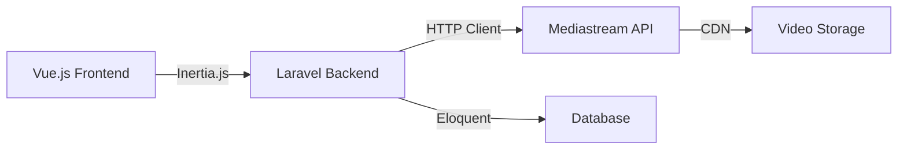

## What is MediaStream?

MediaStream is a full-stack SaaS platform designed for managing and delivering video content at scale. Built on Laravel 12 and Vue.js 3, it provides a complete solution for organizing hierarchical media content like TV series, seasons, and episodes, while integrating seamlessly with external media streaming services.

<Note>
  MediaStream acts as a management layer between your application and media streaming infrastructure, providing an intuitive interface for content organization and delivery.
</Note>

## Why MediaStream?

MediaStream solves the complex challenge of managing structured video content by providing:

<CardGroup cols={2}>
  <Card title="Hierarchical Organization" icon="sitemap">
    Organize content in a natural series → seasons → episodes structure that mirrors traditional broadcast media
  </Card>
  <Card title="Seamless API Integration" icon="plug">
    Built-in integration with Mediastream API for content delivery and video processing
  </Card>
  <Card title="Modern Tech Stack" icon="code">
    Laravel 12 backend with Vue.js 3 and TypeScript frontend, utilizing Inertia.js for seamless page transitions
  </Card>
  <Card title="Production-Ready Auth" icon="shield-check">
    Laravel Fortify authentication with two-factor authentication (2FA) and email verification
  </Card>
</CardGroup>

## Key Benefits

### For Content Managers

- **Intuitive Interface**: Vue.js powered UI with responsive design and real-time updates
- **Chunked Video Upload**: Upload large video files with automatic chunking (10MB chunks) and progress tracking
- **Content Hierarchy**: Manage complex content structures with nested series, seasons, and episodes
- **Image Management**: Automatic CDN integration for thumbnail and poster images

### For Developers

- **Type-Safe Frontend**: Full TypeScript support with Vue 3 Composition API
- **RESTful API**: Complete REST API for programmatic content management
- **Modern Tooling**: Vite for lightning-fast builds, Tailwind CSS 4 for styling
- **Testing Ready**: Pest PHP testing framework included

### For Businesses

- **Scalable Architecture**: Built on Laravel's robust foundation with queue support
- **Secure by Default**: Industry-standard authentication with 2FA and password reset flows
- **Customizable**: Modular design allows easy customization and feature extension
- **Production-Ready**: Includes deployment scripts and environment configuration

## Architecture Overview

MediaStream follows a modern three-tier architecture:



### Frontend Layer

<Info>
  The frontend is built with Vue 3, TypeScript, and Inertia.js, providing a SPA-like experience without the complexity of a separate API layer.
</Info>

**Key Technologies:**
- Vue.js 3.5+ with Composition API
- TypeScript for type safety
- Inertia.js for server-driven SPAs
- Tailwind CSS 4 for styling
- Reka UI for accessible components
- VeeValidate + Zod for form validation

### Backend Layer

The Laravel backend handles authentication, authorization, and acts as a proxy to the Mediastream API:

```php
// Example: MediastreamService.php
public static function request(string $endpoint, string $method = 'get', array $data = []): Response
{
    $baseUrl = rtrim(env('MEDIASTREAM_API_URL'), '/');
    $url = $baseUrl . '/' . ltrim($endpoint, '/');

    $client = Http::withHeaders([
        'X-API-Token' => env('MEDIASTREAM_API_KEY'),
        'Accept' => 'application/json',
    ]);

    // Handles GET, POST, PUT, DELETE requests
}
```

**Key Features:**
- Laravel 12 with PHP 8.2+
- Laravel Fortify for authentication
- RESTful API controllers
- Queue support for async operations
- SQLite/MySQL database support

### Integration Layer

MediaStream integrates with external services through a clean service abstraction:

- **Mediastream API**: Content delivery and video processing
- **CDN Integration**: Automatic image serving via `platform-static.cdn.mdstrm.com`
- **Chunked Upload**: Direct upload to Mediastream servers with progress tracking

## Use Cases

MediaStream is ideal for:

<CardGroup cols={2}>
  <Card title="Streaming Platforms" icon="tv">
    Build Netflix-style streaming services with organized content libraries
  </Card>
  <Card title="Educational Content" icon="graduation-cap">
    Organize course videos into series and lessons with hierarchical structure
  </Card>
  <Card title="Corporate Training" icon="building">
    Manage internal training videos with access control and user management
  </Card>
  <Card title="Content Creators" icon="video">
    Organize and deliver podcast or video series with professional presentation
  </Card>
</CardGroup>

## What's Next?

<CardGroup cols={2}>
  <Card
    title="Explore Features"
    icon="sparkles"
    href="/features"
  >
    Learn about all the features MediaStream offers
  </Card>
  <Card
    title="Get Started"
    icon="rocket"
    href="/getting-started/installation"
  >
    Install and configure MediaStream in minutes
  </Card>
  <Card
    title="API Reference"
    icon="code"
    href="/api/authentication/overview"
  >
    Explore the complete API documentation
  </Card>
  <Card
    title="Architecture Deep Dive"
    icon="diagram-project"
    href="/development/architecture"
  >
    Understand the technical architecture
  </Card>
</CardGroup>

<Tip>
  New to Laravel or Vue.js? MediaStream follows standard Laravel and Vue.js conventions, making it easy to learn if you're familiar with either framework.
</Tip>
